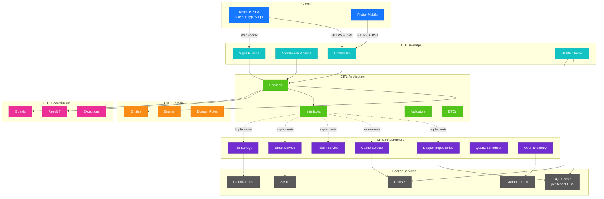
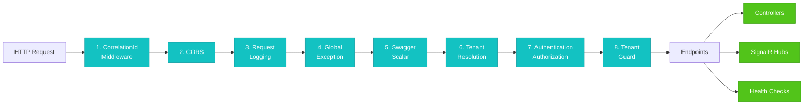
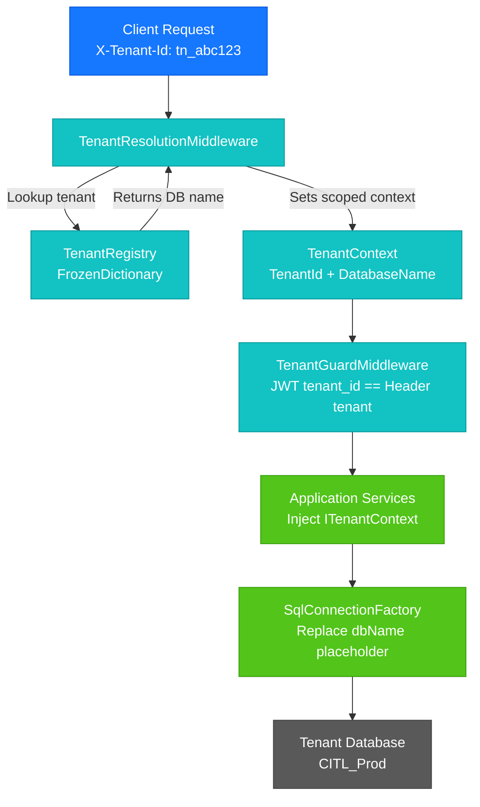
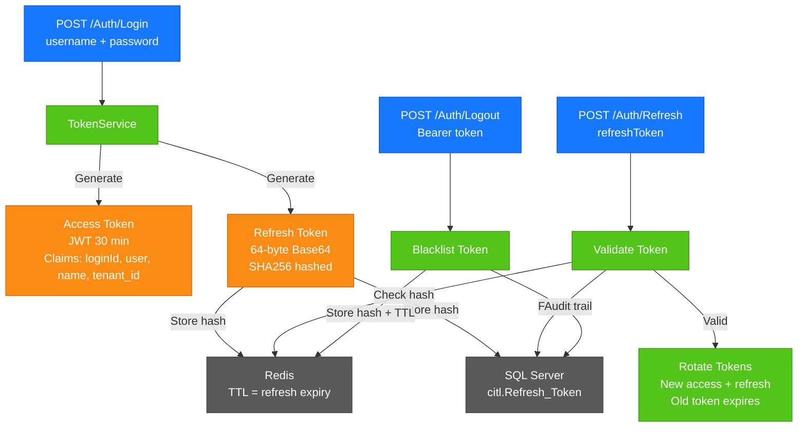
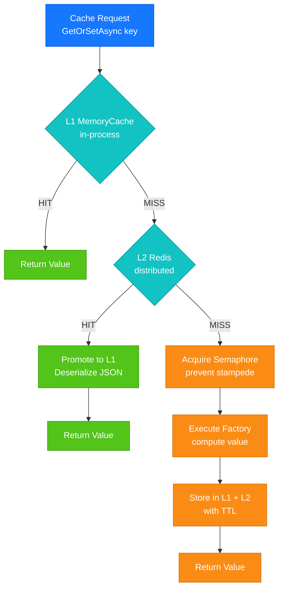
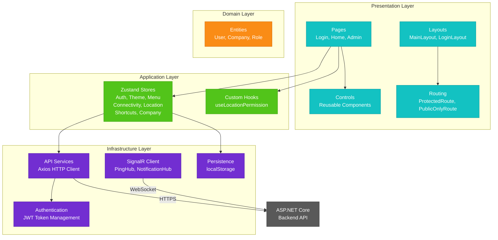

# CITL — Multi-Tenant SaaS Platform

> **Cradle Information Technologies Private Limited**
> © 2022–2026 · All rights reserved.

A production-grade, multi-tenant SaaS platform built on .NET 11 and React 19. Clean Architecture throughout, Dapper for data access, JWT authentication, Redis caching, and full observability via the Grafana LGTM stack.

---

## Tech Stack

### Backend

| Layer | Technology | Version |
|---|---|---|
| Runtime | .NET | 11.0 |
| Language | C# | 13 (preview) |
| Web Framework | ASP.NET Core | 11.0 |
| Data Access | Dapper | 2.1.66 |
| Database | SQL Server | 2019+ |
| Authentication | JWT Bearer | 10.0.3 |
| Caching | Redis (StackExchange) | 10.0.3 |
| Background Jobs | Quartz.NET | 3.15.1 |
| Email | MailKit | 4.15.0 |
| Image Processing | SkiaSharp | 3.119.0 |
| File Storage | Cloudflare R2 / Local (AWSSDK.S3) | 4.0.18.7 |
| Logging | Serilog | 10.0.0 |
| API Docs | Scalar + Swagger UI | 2.12.50 / 10.1.4 |
| OpenTelemetry | OTLP Exporter + Instrumentation | 1.15.0 |

### Frontend

| Technology | Version |
|---|---|
| React | 19.2.4 |
| TypeScript (`@typescript/native-preview` tsgo) | 7.0.0-dev.20260302.1 |
| Vite | 8.0.0-beta.16 (Rolldown/Oxc) |
| Ant Design | 6.3.1 |
| React Router | 7.13.1 |
| React Hook Form | 7.71.2 |
| Zustand | 5.0.11 |
| SignalR Client | 10.0.0 |
| Axios | 1.13.6 |
| Day.js | 1.11.19 |
| ESLint | 10.0.2 |
| Vitest | 4.0.18 |

### Infrastructure (Docker)

| Service | Image | Purpose |
|---|---|---|
| Grafana LGTM | `grafana/otel-lgtm:latest` | Loki + Tempo + Prometheus + OTel Collector |
| Redis | `redis:7-alpine` | Distributed cache + session |

---

## Solution Structure

```
CITL.sln
├── src/
│   ├── CITL.WebApi/            ← Controllers, middleware, DI root, Program.cs
│   ├── CITL.Application/       ← Business logic, services, use cases, DTOs
│   ├── CITL.Domain/            ← Entities, enums, domain rules (zero dependencies)
│   ├── CITL.Infrastructure/    ← Dapper repos, Redis, email, file storage, health checks
│   ├── CITL.SharedKernel/      ← Result<T>, Guards, exceptions, constants
│   └── CITL.Web/               ← React 19 SPA (Vite 8)
└── tests/
    ├── CITL.Application.Tests/
    ├── CITL.Infrastructure.Tests/
    └── CITL.WebApi.Tests/
```

### Architecture Diagrams

#### High-Level Architecture



Inner layers never reference outer layers.

#### HTTP Request Pipeline



#### Multi-Tenancy Flow



#### Authentication Flow



#### Two-Tier Caching



#### Frontend Architecture



---

## Prerequisites

| Tool | Minimum Version |
|---|---|
| .NET SDK | 11.0 preview |
| Node.js | 22 LTS |
| Docker Desktop | Latest |
| SQL Server | 2019+ |

---

## Getting Started

### 1. Clone

```bash
git clone https://github.com/suryatejaKONDLA/LM_v31.git
cd LM_v31/CITL
```

### 2. Start Infrastructure (Docker)

```powershell
# Windows
.\scripts\start-infra.ps1

# Linux / macOS
./scripts/start-infra.sh
```

This starts:
- **Grafana** at `http://localhost:3000` (admin / password set via `GF_ADMIN_PASSWORD` in `.env`)
- **Redis** at `localhost:6379`
- **OTLP gRPC** at `localhost:4317`
- **OTLP HTTP** at `localhost:4318`

### 3. Configure Secrets

Sensitive values are **never stored in `appsettings*.json`**. They live in [.NET User Secrets](https://learn.microsoft.com/en-us/aspnet/core/security/app-secrets) (Development) or environment variables (Production).

#### Initialize User Secrets (one-time)

```bash
cd src/CITL.WebApi
dotnet user-secrets init
```

> The `UserSecretsId` is already set in `CITL.WebApi.csproj` — this command is a no-op if already initialised.

#### Set All Required Secrets

```bash
cd src/CITL.WebApi

# SQL Server connection string (replace values for your environment)
dotnet user-secrets set "MultiTenancy:ConnectionStringTemplate" "Server=YOUR_SERVER;Database={dbName};User Id=sa;Password=YOUR_PASSWORD;Encrypt=true;TrustServerCertificate=true;MultipleActiveResultSets=true;Connection Timeout=30;Application Name=CITL"

# JWT signing key — generate a random 64-byte Base64 string:
#   [Convert]::ToBase64String([System.Security.Cryptography.RandomNumberGenerator]::GetBytes(64))
dotnet user-secrets set "Jwt:SecretKey" "YOUR_BASE64_JWT_SECRET"

# Cloudflare R2 Storage
dotnet user-secrets set "FileStorage:R2Endpoint" "https://YOUR_ACCOUNT_ID.r2.cloudflarestorage.com"
dotnet user-secrets set "FileStorage:R2AccessKey" "YOUR_R2_ACCESS_KEY"
dotnet user-secrets set "FileStorage:R2SecretKey" "YOUR_R2_SECRET_KEY"
dotnet user-secrets set "FileStorage:R2BucketName" "YOUR_BUCKET"
dotnet user-secrets set "FileStorage:R2PublicDomain" "https://YOUR_CUSTOM_DOMAIN"
```

#### Generate a JWT Secret Key

```powershell
# PowerShell
[Convert]::ToBase64String([System.Security.Cryptography.RandomNumberGenerator]::GetBytes(64))
```

```bash
# Bash
openssl rand -base64 64
```

#### List / Clear Secrets

```bash
# View all set secrets
dotnet user-secrets list

# Remove a single secret
dotnet user-secrets remove "Jwt:SecretKey"

# Remove all secrets
dotnet user-secrets clear
```

#### Non-Secret Configuration

Non-sensitive Development overrides (log level, Redis URL, OTLP endpoint, CORS origins, tenant mappings) remain in `appsettings.Development.json` and are safe to commit.

### 4. Run the Backend

```powershell
# Windows — starts infra + WebApi together
.\scripts\start.ps1

# Or manually
cd src/CITL.WebApi
dotnet run
```

API endpoints once running:
- **Swagger UI** → `https://localhost:7001/swagger`
- **Scalar** → `https://localhost:7001/scalar`
- **Health** → `https://localhost:7001/health`

### 5. Run the Frontend

```bash
cd src/CITL.Web
npm install
npm run dev
```

Frontend dev server: `http://localhost:5173`

---

## Build

### Backend

```bash
dotnet build
dotnet publish -c Release
```

### Frontend

```bash
cd src/CITL.Web
npm run build
```

Output lands in `src/CITL.Web/dist/` — includes `web.config` for IIS deployment with Brotli/Gzip precompressed serving and React Router fallback.

---

## Scripts

| Script | Purpose |
|---|---|
| `scripts/set-secrets.ps1` / `.sh` | **Interactive secrets setup** — set all user-secrets in one go |
| `scripts/pull-schema.ps1` / `.sh` | Extract SQL schema per tenant via `sqlpackage` |
| `scripts/start.ps1` / `.sh` | Start infra (Docker) + WebApi |
| `scripts/start-infra.ps1` / `.sh` | Start only Docker services |
| `scripts/build.ps1` / `.sh` | Full solution build |
| `scripts/publish.ps1` / `.sh` | Publish for deployment |

### Frontend npm scripts

| Command | Purpose |
|---|---|
| `npm run dev` | Start Vite dev server |
| `npm run build` | Production build + copy `web.config` |
| `npm run lint` | ESLint (zero warnings) |
| `npm run check` | Lint + TypeScript type-check |
| `npm run test` | Vitest unit tests |
| `npm run test:ui` | Vitest UI |
| `npm run test:coverage` | Coverage report |
| `npm run packages:outdated` | Show outdated packages |
| `npm run clean` | Clear dist + Vite cache |
| `npm run clean:all` | Full reset (node_modules + dist) |

---

## Architecture

### Multi-Tenancy (Database-per-Tenant)

Each tenant gets an isolated SQL Server database. The connection string uses a `{dbName}` placeholder replaced at runtime:

```
Server=...;Database={dbName};...
```

Tenant resolution flows via a **scoped `TenantContext`** injected through DI — no `AsyncLocal`, no static state.

### Authentication

JWT Bearer tokens with short-lived access tokens (30 min) and long-lived refresh tokens (30 days). Token payload carries tenant and role claims. Works identically for the React SPA and Flutter mobile client.

### Caching

Two-tier:
- **L1** — `IMemoryCache` (in-process, ~0 ms)
- **L2** — Redis (shared across servers, ~1–2 ms)

Cache keys follow the pattern `{tenant}:{entity}:{id}`.

### Health Checks

10 health checks registered and exposed at `/health`:

| Check | What it monitors |
|---|---|
| SQL Server | Tenant database connectivity |
| Redis | Cache connectivity |
| R2 Storage | Cloudflare R2 bucket reachability |
| Disk Space | Local folder quota usage |
| Process Memory | Working set vs threshold |
| Quartz Scheduler | Background job scheduler state |
| Grafana | Grafana dashboard reachability |
| OTLP Collector | OpenTelemetry collector reachability |
| Mail | SMTP connectivity |
| SignalR | Hub connectivity |

### Observability

Full OpenTelemetry pipeline → Grafana LGTM stack:
- **Traces** → Tempo
- **Metrics** → Prometheus
- **Logs** → Loki (via Serilog OTLP sink)

Grafana dashboards are pre-provisioned in `grafana/dashboards/`.

---

## Deployment

The frontend `dist/` folder is a static SPA deployable to IIS. The included `web.config` handles:
- **Brotli** precompressed asset serving
- **Gzip** fallback
- **React Router** SPA fallback (`index.html`)
- **Security headers** (CSP, X-Frame-Options, HSTS-ready, etc.)
- **Immutable cache** headers for versioned assets

---

## Key Conventions

- **Constants** — PascalCase, never UPPER_SNAKE_CASE
- **`var`** everywhere the compiler allows
- **Braces** always (Allman style)
- **Async** — `Async` suffix, always accept `CancellationToken`, `.ConfigureAwait(false)` in library code
- **Null checks** — `is null` / `is not null`
- **Logging** — `[LoggerMessage]` source-generator, never `_logger.LogXxx()`
- **Errors** — `Result<T>` for business logic, exceptions for infrastructure

Full details in [CODING_STANDARDS.md](CODING_STANDARDS.md).

---

## Project Info

| | |
|---|---|
| **Company** | Cradle Information Technologies Private Limited |
